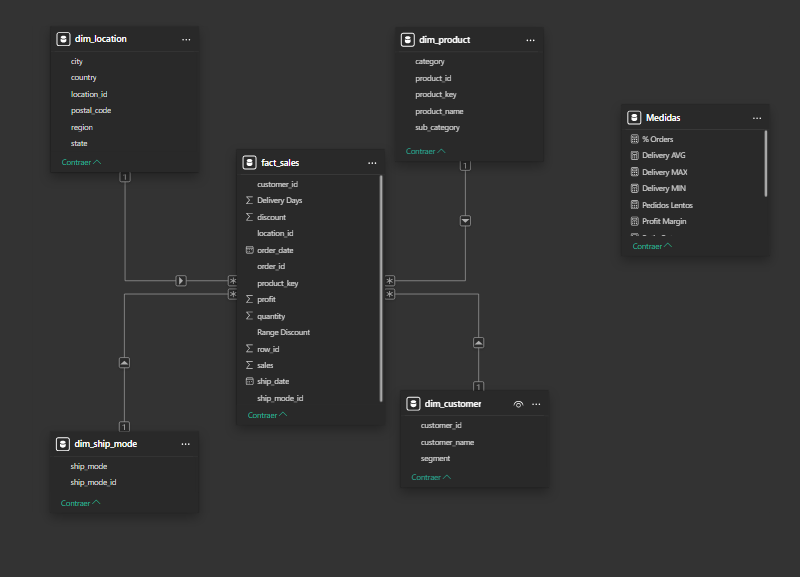

# Proyecto: Modelado de Data Warehouse de Ventas (Superstore)

## Descripción del proyecto

Este proyecto consiste en el diseño e implementación de un modelo dimensional tipo estrella utilizando SQL, a partir de un dataset de ventas -> (data/superstore.csv). El objetivo fue transformar datos sin estructura analítica en un modelo optimizado para análisis, garantizando consistencia, integridad y facilidad de consulta.

El proceso incluyó limpieza de datos con Python, Análisis exploratorio inicial de métricas, creación de vistas SQL para dimensiones y tabla de hechos, y construcción de un modelo dimensional para soporte analítico..

---

## Modelo de datos

Se implementó un modelo estrella compuesto por:

- Tabla de hechos: 
  - fact_sales
- Dimensiones:
  - dim_customer
  - dim_product
  - dim_location
  - dim_ship_mode

Este modelo permite separar atributos descriptivos de métricas, optimizando el rendimiento y la claridad del análisis.

Imagen del modelo:

---

## Limpieza y transformación de datos

Se realizaron procesos de Exploración, limpieza y transformación utilizando Python y SQL, incluyendo:

- Exploración de nulos en [python/eda_heatmap.py](python/eda_heatmap.py)
- Eliminación de inconsistencias en los datos
- Estandarización de columnas y limpieza que quedaron guardados en [Data/clean_superstore.csv](Data/clean_superstore.csv)
- Creación de dimensiones mediante vistas SQL [sql/ModeladoEstrella.sql](sql/ModeladoEstrella.sql)
- Separación de atributos en tablas dimensionales

---

## Decisiones técnicas

### Manejo de product_id duplicados

Se identificó que el campo product_id no era único y estaba asociado a diferentes nombres de producto, lo que generaba inconsistencias.

Para resolver este problema, se implementó una _surrogate key_ en la dimensión de productos, garantizando unicidad e integridad en el modelo.

### Uso de claves sustitutas (Surrogate Keys)

Se utilizaron claves sustitutas en dimensiones como location y ship_mode para:

- Garantizar unicidad
- Evitar dependencia de claves naturales inconsistentes
- Mejorar la integridad de las relaciones

---

## Capa semántica y medidas analíticas

Se implementaron medidas DAX dentro del modelo de Power BI para soportar el análisis y monitoreo de métricas clave.

Estas medidas permiten:

- Calcular profit total
- Identificar transacciones con pérdidas
- Analizar impacto de descuentos en la rentabilidad
- Evaluar tiempos de entrega
- Detectar anomalías operativas

Las medidas fueron construidas sobre el modelo dimensional, asegurando consistencia y precisión en los cálculos analíticos.

---

### Uso de modelo estrella

Se implementó un modelo dimensional tipo estrella para optimizar consultas analíticas y separar correctamente hechos y dimensiones.

## Resultado

El resultado es un modelo dimensional funcional, estructurado y optimizado para análisis, que resuelve problemas de integridad presentes en el dataset original y permite realizar consultas analíticas de forma eficiente.

---

Las conclusiones y hallazgos analíticos pueden encontrarse en:
[PowerBI/hallazgos.txt](PowerBI/hallazgos.txt)

## Herramientas utilizadas

- SQL
- Python (Pandas)
- Power BI
- Git y GitHub
